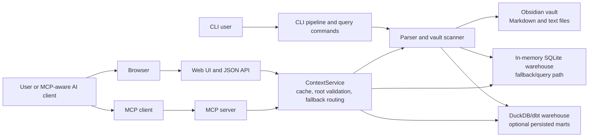
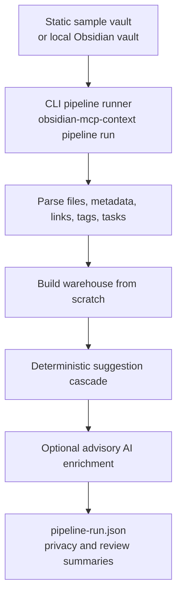

# Architecture

This project turns a plain-text Obsidian vault into structured, source-linked
context. The vault remains the source of truth. The core shape is a deterministic
compiler function:

```text
vault -> parse -> warehouse -> suggestions -> optional advisory AI -> reports
```

The public repository is intentionally Obsidian-first. It supports the checked-in
static sample vault and local Obsidian vaults.

## Runtime View



The web UI and MCP server share `ContextService`. That service checks for a
valid dbt-built DuckDB warehouse when one is configured. If no persisted
warehouse is available, it falls back to parsing the vault and building the
smaller in-memory warehouse.

## Pipeline View



The pipeline is a local sequential command, not a background orchestrator. Runtime
state is written under the configured output directory, usually `var/`.

## Main Components

| Component | Role |
| --- | --- |
| `obsidian_mcp_context.parser` and `vault` | Parse Markdown into headings, blocks, tasks, links, tags, semantic lines, and provenance. |
| `obsidian_mcp_context.pipeline` | Resolve source profiles and run the local sequential pipeline. |
| `obsidian_mcp_context.warehouse` | Build the in-memory warehouse, deterministic suggestions, and review tables. |
| `obsidian_mcp_context.enrichment` | Run optional advisory AI enrichment over deterministic candidates. |
| `obsidian_mcp_context.ingest` | Load parsed vault rows into DuckDB landing tables for dbt. |
| `models/staging`, `models/intermediate`, `models/marts` | Transform landing tables into queryable dbt views and marts. |
| `obsidian_mcp_context.dbt_warehouse` | Read dbt marts from DuckDB for generic entities, relationships, states, events, open loops, and typed compatibility rows. |
| `obsidian_mcp_context.services` | Shared service layer for web and MCP, including dbt detection and in-memory fallback. |
| `obsidian_mcp_context.web_ui` | Browser UI, question endpoint, status endpoint, generic entity API, and typed compatibility API. |
| `obsidian_mcp_context.mcp_server` | MCP tools for notes, blocks, tasks, note context, warehouse summary, generic entity context/events/states/relationships/open loops, and typed compatibility tools. |
| `obsidian_mcp_context.status` | Runtime status for configured warehouse files, required marts, and row counts. |

## Primary Data Contracts

| Layer | Important Outputs |
| --- | --- |
| Landing tables | `base_obsidian_files`, `base_obsidian_blocks`, `base_obsidian_tasks`, `base_obsidian_links`, `base_obsidian_tags`, `base_obsidian_lines` |
| Staging views | `stg_obsidian_files`, `stg_obsidian_blocks`, `stg_obsidian_tasks`, `stg_obsidian_links`, `stg_obsidian_tags`, `stg_obsidian_lines` |
| Intermediate views | `int_obsidian_entities`, `int_obsidian_link_resolution`, `int_obsidian_related_entities` |
| Core marts | `dim_notes`, `dim_entities`, `dim_entity_types` |
| Generic fact marts | `fact_blocks`, `fact_tasks`, `fact_links`, `fact_tags`, `fact_mentions`, `fact_entity_relationships`, `fact_entity_states`, `fact_entity_events` |
| Generic context marts | `mart_timeline`, `mart_entity_context`, `mart_entity_open_loops` |
| Typed compatibility marts | `dim_people`, `dim_companies`, `dim_projects`, `fact_decisions`, `fact_risks`, `mart_open_loops`, `mart_person_context`, `mart_project_context` |
| Review tables | `deterministic_suggested_links`, `ai_suggested_links` |

## Query Surfaces

| Surface | Examples |
| --- | --- |
| CLI | `obsidian-mcp-context --vault ... notes`, `blocks`, `tasks`, `warehouse-summary`, `agent-context`, `pipeline run` |
| MCP | `list_vault_notes`, `search_vault_blocks`, `get_vault_entity_context`, `list_vault_entity_states`, `get_vault_project_context` |
| Web UI | Browser query interface and pipeline status panel |
| JSON API | `/api/entity-types`, `/api/entities/{type}/{name}/context`, `/api/states?entity_type=risk`, `/api/projects/{project}/context` |

## Generic Entity Model

`dim_entities` is the canonical registry. Each entity has an `entity_type`,
stable `entity_id`, display `name`, optional source note, and optional canonical
note id. `dim_entity_types` records the entity types observed in the warehouse.

Generic marts attach data to any entity type:

- `fact_entity_relationships`: source-target relationships such as mentions and
  note links.
- `fact_entity_states`: status-bearing rows such as open risks and open tasks.
- `fact_entity_events`: date-bearing rows for decisions, risks, tasks, and
  timeline evidence.
- `mart_entity_context`: reusable entity context rows.
- `mart_entity_open_loops`: unresolved work grouped by entity.
