# Architecture

The supported project architecture is Postgres-first and generated-vault-only.

```mermaid
flowchart LR
  fixture["Generated vault fixture"]
  mount["Container mount at /vault"]
  ingest["Postgres ingest job"]
  postgres["Postgres raw tables"]
  dbt["dbt Postgres models"]
  marts["Postgres marts"]
  mcp["MCP server"]
  client["MCP client"]

  fixture --> mount
  mount --> ingest
  ingest --> postgres
  postgres --> dbt
  dbt --> marts
  marts --> mcp
  mcp --> client
```



## Runtime Contract

- Generated fixtures are the source input.
- Postgres is the only supported warehouse for the project workflow.
- dbt builds marts in Postgres.
- MCP modeled tools read the Postgres marts.
- Direct parser tools remain diagnostics for source inspection.
- Personal Obsidian vaults are out of scope.

## Main Modules

| Module | Responsibility |
| --- | --- |
| `obsidian_mcp_context.parser` and `vault` | Parse Markdown into headings, blocks, tasks, links, tags, semantic lines, and provenance. |
| `obsidian_mcp_context.ingest_postgres` | Load parsed generated-vault rows and redacted profile metadata into Postgres landing tables. |
| `obsidian_mcp_context.postgres_warehouse` | Read dbt marts from Postgres for entities, relationships, states, events, open loops, decisions, risks, and typed compatibility rows. |
| `obsidian_mcp_context.services` | Shared service layer for MCP calls, including Postgres mart routing and diagnostic fallback. |
| `obsidian_mcp_context.mcp_server` | MCP tools for parser diagnostics and Postgres mart-backed context. |

## Verification

Run the generated-large stack:

```bash
scripts/analytics_stack_check.sh large
```

This validates ingest, dbt run, dbt tests, and Postgres-backed MCP smoke checks.
