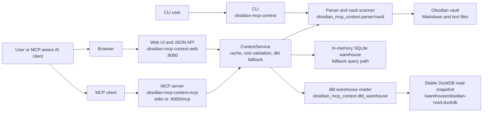
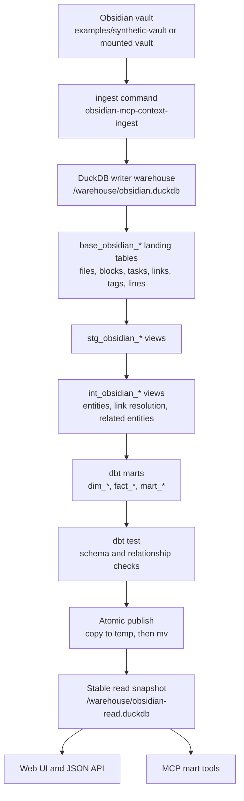
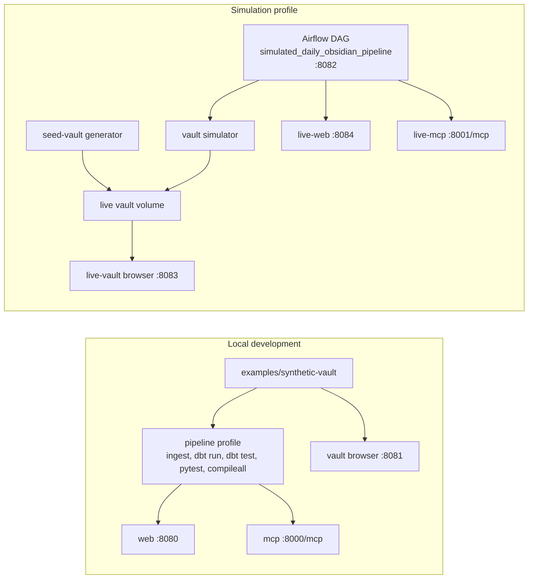

# Architecture

This project turns a plain-text Obsidian vault into structured, source-linked
context. The vault remains the source of truth. The app can query the vault
directly in memory, or read richer dbt marts from a DuckDB snapshot when the
pipeline has produced one.

## Runtime View

The web UI and MCP server share `ContextService`. That service first checks for
a valid dbt-built DuckDB warehouse. If one is available, mart-backed queries use
the stable read snapshot. If not, the service falls back to parsing the vault
and building the smaller in-memory warehouse.

## Pipeline View

The pipeline writes to the primary DuckDB file and publishes a separate read
snapshot only after dbt succeeds. Long-running web and MCP processes read the
snapshot, so users do not query a half-built warehouse while the next pipeline
run is in progress.

## Mode View

Local development uses the checked-in synthetic vault. The simulation profile
creates a seeded vault, advances it over virtual days, and uses Airflow to run
the same ingest and dbt pipeline repeatedly against the live vault volume.

## Main Components

| Component | Role |
| --- | --- |
| `obsidian_mcp_context.parser` and `vault` | Parse Markdown into headings, blocks, tasks, links, tags, semantic lines, and provenance. |
| `obsidian_mcp_context.ingest` | Load parsed vault rows into DuckDB landing tables. |
| `models/staging`, `models/intermediate`, `models/marts` | Transform landing tables into queryable dbt views and incremental mart tables. |
| `obsidian_mcp_context.dbt_warehouse` | Read dbt marts from DuckDB for projects, people, companies, decisions, risks, open loops, and context rows. |
| `obsidian_mcp_context.services` | Shared service layer for web and MCP, including dbt detection and in-memory fallback. |
| `obsidian_mcp_context.web_ui` | Browser UI, question endpoint, status endpoint, and formal JSON API. |
| `obsidian_mcp_context.mcp_server` | MCP tools for notes, blocks, tasks, note context, warehouse summary, entities, project/person context, decisions, risks, and open loops. |
| `obsidian_mcp_context.status` | Runtime status for writer/read warehouses, required marts, row counts, and simulation state. |
| `obsidian_mcp_context.synthetic` and `simulator` | Deterministic demo-vault generation and live-vault advancement for testing. |

## Primary Data Contracts

| Layer | Important Outputs |
| --- | --- |
| Landing tables | `base_obsidian_files`, `base_obsidian_blocks`, `base_obsidian_tasks`, `base_obsidian_links`, `base_obsidian_tags`, `base_obsidian_lines` |
| Staging views | `stg_obsidian_files`, `stg_obsidian_blocks`, `stg_obsidian_tasks`, `stg_obsidian_links`, `stg_obsidian_tags`, `stg_obsidian_lines` |
| Intermediate views | `int_obsidian_entities`, `int_obsidian_link_resolution`, `int_obsidian_related_entities` |
| Core marts | `dim_notes`, `dim_entities`, `dim_people`, `dim_companies`, `dim_projects` |
| Fact marts | `fact_blocks`, `fact_tasks`, `fact_links`, `fact_tags`, `fact_mentions`, `fact_decisions`, `fact_risks` |
| Context marts | `mart_timeline`, `mart_open_loops`, `mart_person_context`, `mart_project_context` |

## Query Surfaces

| Surface | Examples |
| --- | --- |
| CLI | `obsidian-mcp-context --vault ... notes`, `blocks`, `tasks`, `warehouse-summary`, `agent-context` |
| MCP | `list_vault_notes`, `search_vault_blocks`, `get_vault_project_context`, `list_vault_risks` |
| Web UI | Browser query interface and pipeline status panel |
| JSON API | `/api/projects`, `/api/projects/{project}/context`, `/api/risks?status=open`, `/api/open-loops` |
